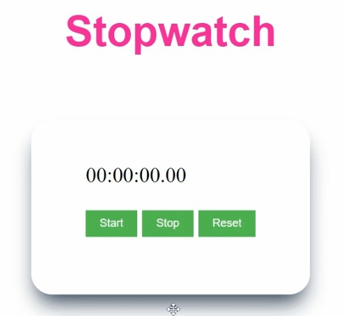

# JavaScript Projects

## 1) Calculator App

This is simple calculator app.

## Key Learnings

- Dom manipulation

## Working

## 2) Countdown App

This is simple Countdown app in which user can enter a number and app will countdown till 0.

## Key Learnings

- Dom manipulation

## Working

## 3) Palindrome checker game

User can enter a string and this app will check id the string is plindrome or not.

## Key Learnings

- Dom manipulation

## Working

## 4) Random quote generator 

With the help of this user can genrate random quote.

## Key Learnings

- API
- Dom manipulation

## Working

## 5) Stopwatch app 

This is simple Stopwatch app.

## Key Learnings

- Dom manipulation

## Working

## 6) Theme changer

With the help of this theme chnager user can select dark/light mode.

## Key Learnings

- Dom manipulation

## Working

## 7) Word count app

This app provides the charcter count from the input provided by the user.

## Key Learnings

- Dom manipulation

## Working

